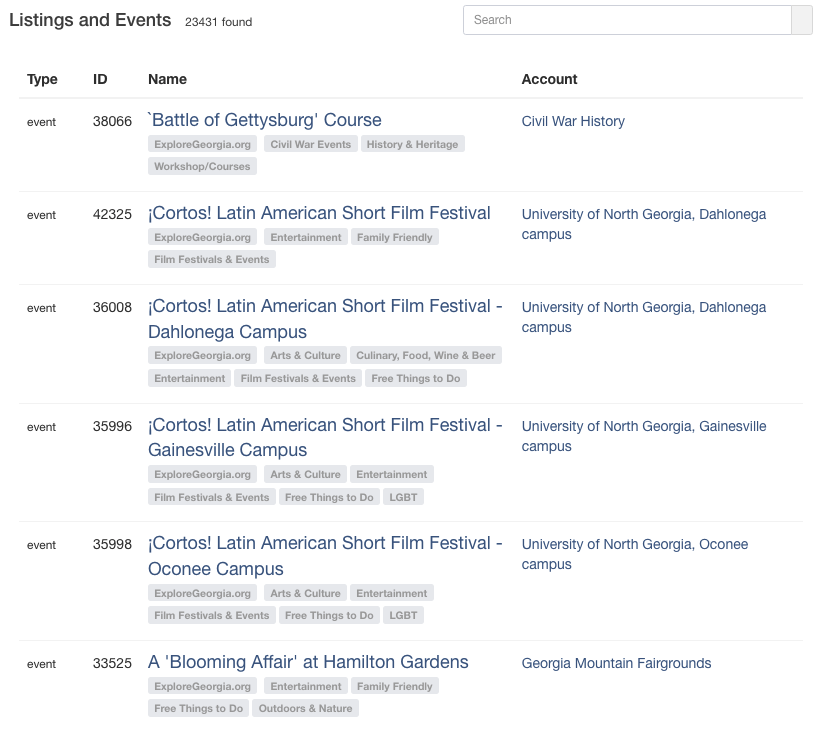
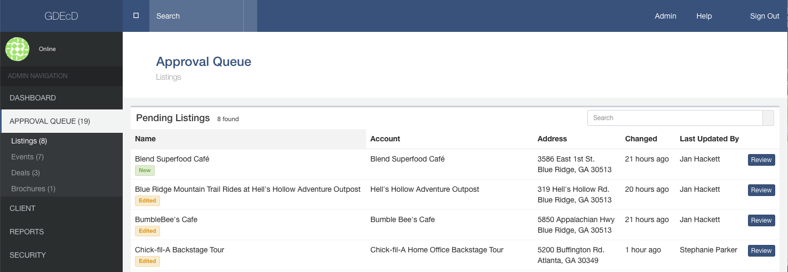
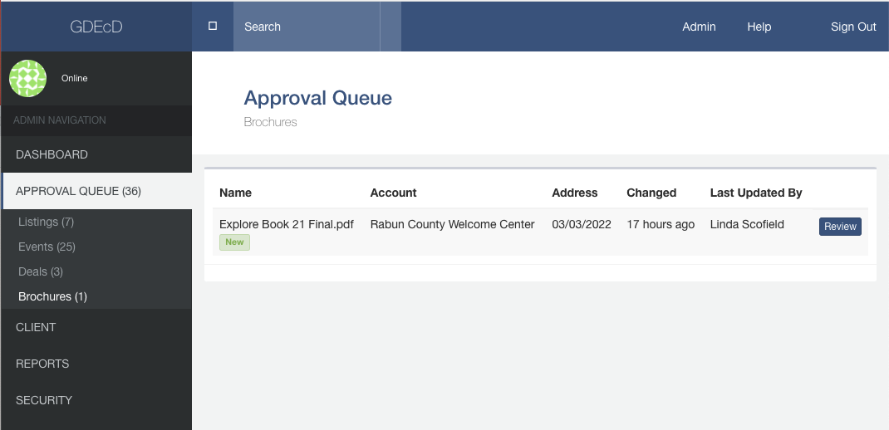
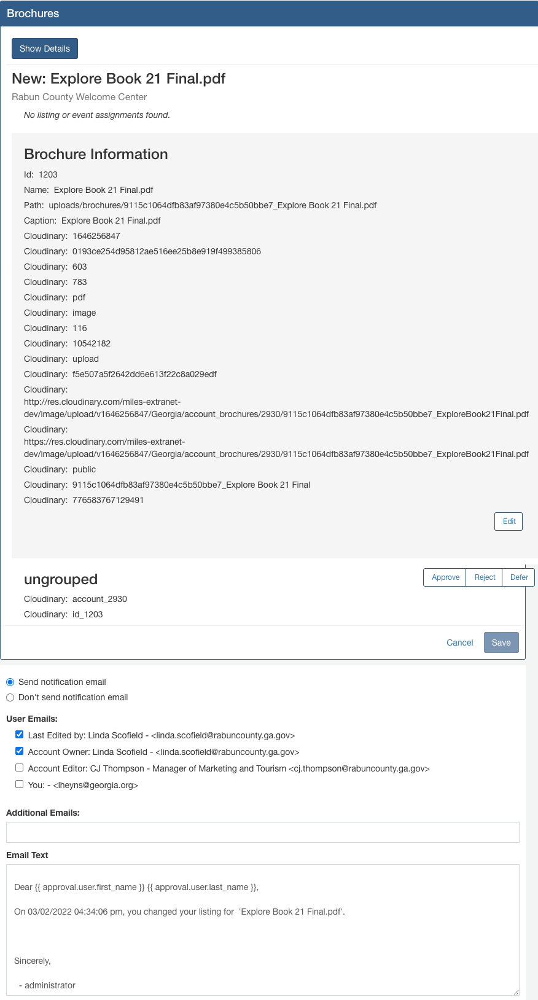
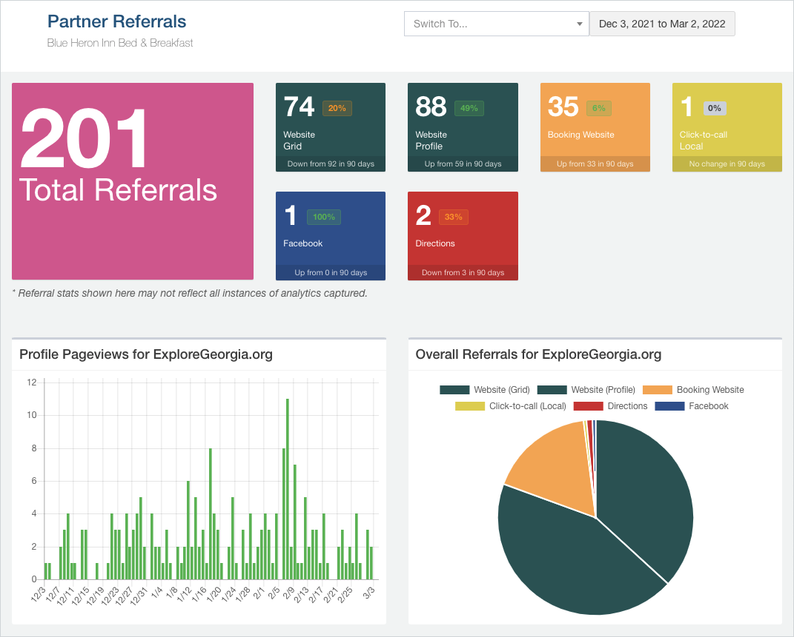
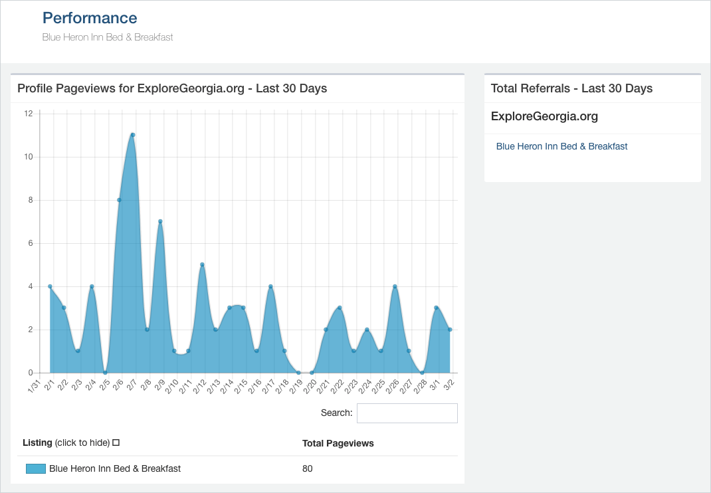

# Current Partner Tools

An overview of the current partner tools.  

## List of Partners and Events

Includes category tags. Clicking tabs sorts columns.

**Nice to Have**  
Show the most recently edited items first.  
Include: Edited by [name] on [date] - With the editor's name clickable.  
Include filters from frontend to filter by region, city, category, etc.  
Make the category tags clickable to filter by category.  
Add a small calendar icon to the right of the search field to open a date range filter.  
Include a thumbnail image to the left of each row.  
Omit the Type and ID columns to conserve space. Include these after the name.  

  

## Approval Queue

  

## Brochure Approval Queue

  

## Brochure Approval Detail

**Nice to Have**  
Hide extra cloudinary data under a "More" link.  
Avoid button overlap of right side.  
If correct, rename radio button to: "Send notification email when listing is changed."  
Rename "User Emails" to "Send notification to:"  
The text says "you changed your listing for ABC", but the emails can go to other individuals.  

  

## Calendar

**Nice to Have**  
Integration with external partner calendars.  
Display calendar layout in frontend. Try [elfsight calendar widgets](https://elfsight.com/event-calendar-widget/)  

## Performance

**Nice to Have**  
Include additional traffic from cached pages by including charts from our cloudflare.com Content Delivery Network (CDN).  
Make Referral boxes clickable to explore which booking websites are making referrals.  
Add info below charts to explain Website Grid and Website Profile.  
If correct, include: "Directions" indicates the number of requests to view directions to your location from within our website.  

  

**Nice to Have**  
Provide a link to website traffic for the entire website when logged in as a staff member.  

  

What additional Economic Development data sources would we like to cross-relate for partners?  
Examples: Page visitor travel interests, impacts on local industries and jobs, positive environmental impacts  
