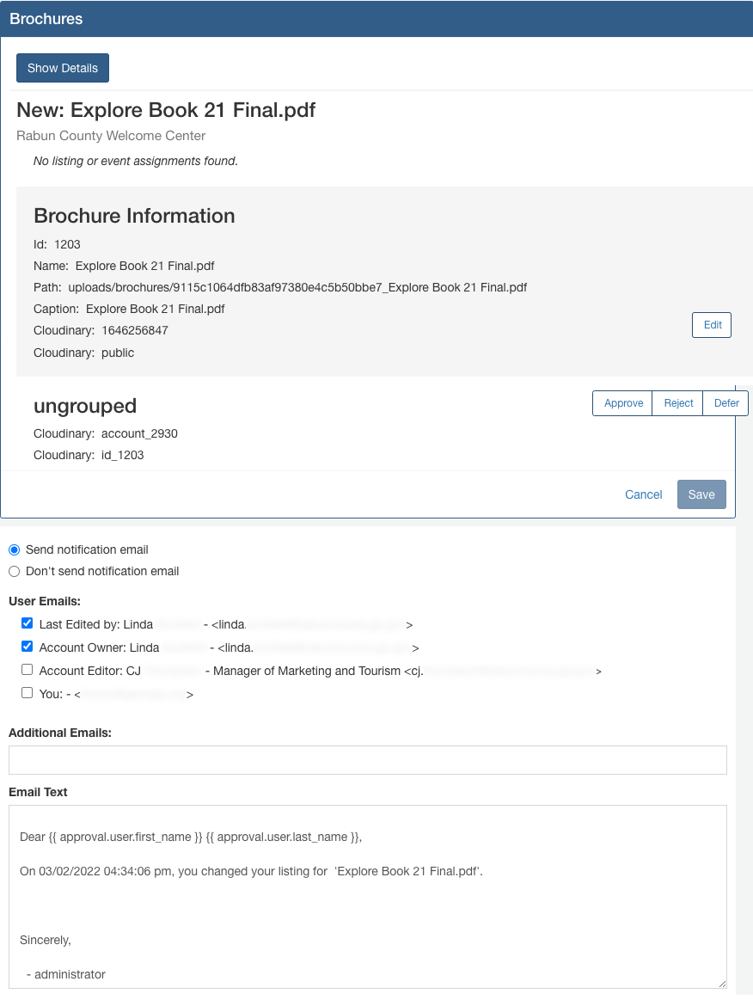
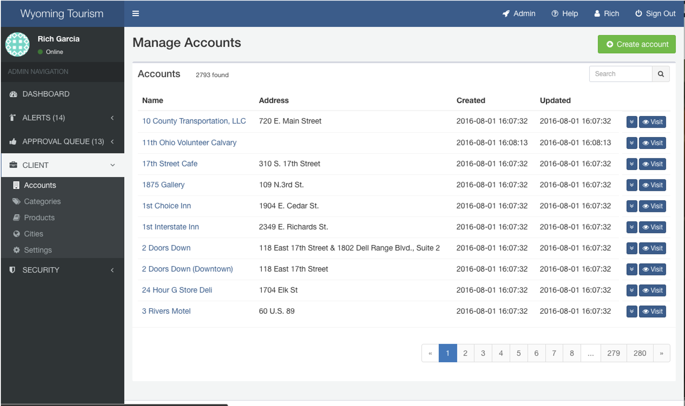
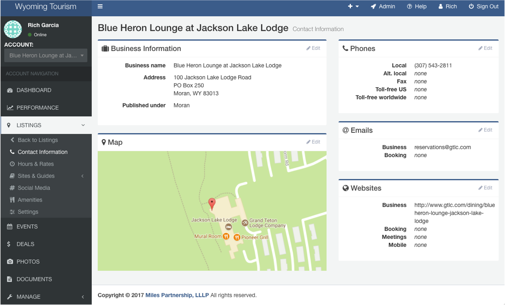

# Partner Tool Overview

Overview of fields and functionality. 
All fields and functionality are manditory unless listed under "Nice to Have"  

"May use frontend components" refers to allowing editors to remain in the main website (ExploreGeorgia.org) when logging in and submitting changes. Similar to Facebook, an item's "edit" link would only be visible to its associated editors/owners.  

## My Profile

Each user has one user profile, which can be related to multiple organization accounts.  

My Name (First and Last)  
My Title
My Email (for admins only)  

**Profile Navigation**
- My Organization(s) (Account/Client) - Example: Georgia State Parks
- My Locations - Example: Unicoi State Park
- My Events - Example: New Year's Hike
- Sign out

Each user profile page should list or link to the user's organizations, related locations and active events.

To the right of organization rows, include the user's role [Editor, Owner].  
Include a "Remove" option for each relation row.

## Organization Account Details

Each organization's account page features their related locations and events.

Partner "Organizations" have related Individuals, Locations and Events.  
Roles set at the Organzation level apply to Locations and Events.  
Roles may also be set directly for Locations and Events.  

- Locations
- Events
- Individuals

## User Roles

A list of individuals for each organization, location and event.

**Sortable columns**
Name (First and Last)  
Email  
Role  

**Functionality**
Row menu: User Profile, Remove User  
Add an existing user [As an Editor] [As an Owner]  
Add new user - Not a link on current page, user must add themselves.  

**Current issue**  
Clicking email goes to account detail, row menu needed.  

## User Lists

**Columns**
Name  
Title  
Email  

**Location Roles** (list)
Location
Role (Member, Editor, Owner)

## Locations and Events

**Fields**
Name - with link to detail
Presenter (Organization or other group) - with link to detail
Category Tags (under the name)
Type and ID (under the name rather than columns)
Edited By  
Date Edited  

**Functionality**
Clicking tabs sorts columns.
Search field which filters by Location, Account, Tags
Send filters to the URL (page, sort, order)

**Nice to Have**  
Show the most recently edited items first.  
Include: Edited by [name] on [date] - With the editor's name clickable.  
Include filters from frontend to filter by region, city, category, etc.  
Make the category tags clickable to filter by category.  
Add a small calendar icon to the right of the search field to open a date range filter.  
Include a thumbnail image to the left of each row.  
Omit the Type and ID columns to conserve space. Include these after the name.  

**Current Miles Interface** (Future design layouts may differ and may use frontend components.)  
Types are currently Location, Event, Deal  

 

## Listings

**Drupal Interface** (Current location list. Future design layouts may differ.)

 

## Listing Detail

**Drupal Interface** (Current fields. Future design layouts may differ.)

## Approval Queue

**Columns**
Listing/Event
Presenter (Organization)
Address
Changed
Changed By

**Functionality**
Row menu: Review
Search
Sort columns

**Nice to have**
Data search

**Current Miles Interface** (Future design layouts may differ and may use frontend components.)  

  

## Brochure Approval Queue

**Current Miles Interface** (Future design layouts may differ and may use frontend components.)  

  

## Brochure Approval Detail

**Current Issues**  
1. The default email notification text is "you changed your listing for ABC", however the default email goes to others.  
The default notification text could be changed to:  
Brochure updated: [brochure name]
Submitted by [name] on [datetime] 
2. Displays extra cloudinary data. Future solution could use a "More" link instead to hide non-essentials.  
3. Buttons overlap right side.  
4. To add clarity, radio button could be: "Send notification email when listing is changed."  
5. To add clarity, "User Emails" could be "Send notification to:"  

**Current Miles Interface** (Future design layouts may differ and may use frontend components.) 

  

## Organization List (Clients)

Side navigation could be called "Organizations" or "Client".

 

## Listing Sections

 

## Calendar

**Nice to Have**  
Integration with external partner calendars.  
Display calendar layout in frontend. Try [elfsight calendar widgets](https://elfsight.com/event-calendar-widget/)  

## Performance

**Nice to Have**  
Include additional traffic from cached pages by including charts from our cloudflare.com Content Delivery Network (CDN).  
Make Referral boxes clickable to explore which booking websites are making referrals.  
Add info below charts to explain Website Grid and Website Profile.  
If correct, include: "Directions" indicates the number of requests to view directions to your location from within our website.  

**Current Miles Interface** (Future design layouts may differ and may use frontend components.) 

  

**Nice to Have**  
Provide a link to website traffic for the entire website when logged in as a staff member.  

**Current Miles Interface** (Future design layouts may differ and may use frontend components.) 

  

**Additional Reporting for Partners**  
What additional Economic Development data sources would we like to cross-relate for partners?  
Examples: Page visitor travel interests, Impacts on local industries and jobs, Positive environmental impacts  

<!--
List of partner locations shows pending changes for admin approval 

Events near partner locations 

Deals for and near partner locations 

Photos for partner locations. Galleries for communities. 

Brochures and documents for partner locations 

Frontend maps for partner locations 

Partner calendar and event detail page 

Places to stay by type, region, city, category 
-->

## Categories

Ideally "Camera Ready" is simply one of the category options under "Film Production" to keep management simiple.  
Categories can be selectively displayed on the Listing Detail pages.  

### Adventure
 ATV & Motocross
 Airplane Dog Fighting
 Caving (Spelunking)
 Hang Gliding
 Motorcycling
 Rappelling
 Rock Climbing
 Skydiving
 Tree Climbing
 Zipline

### Agritourism
 Agritourism Trails & Tours
 Farm to Table
 Farmers Markets
 Farms & Ranches

### Arts & Culture
 Cultural Trails & Tours
 Galleries
 Museums
 Music
 Performing Arts
 Theaters

### Entertainment
 Amusement Centers
 Animal Parks & Zoos
 Aquariums
 Casinos
 Cruises
 Group Tours
 Live Music
 Miniature Golf
 Movie Theaters
 Theme Parks
 Tours

### Film Production
 Noteworthy Film Site
 Camera Ready

### Food & Drink
 Bakeries
 Bar & Grills
 Bars, Clubs & Nightlife
 Brew Pubs & Wine Bars
 Buffets
 Cafes, Coffeehouses & Tea Rooms
 Cafeterias & Food Courts
 Casual Full Service
 Culinary Experiences
 Deli & Sandwiches
 Diners
 Fine Dining
 Food Tours
 Ice Cream & Desserts
 Pizzerias
 Sports Bar & Pubs
 Steakhouses & Seafood
 Wineries, Breweries & Distilleries

### Golf
 Georgia Golf Trail
 Golf Courses
 Golf Schools
 Ranges & Practice Facilities

### Group Event Venues
 Convention & Conference Centers
 Fairgrounds